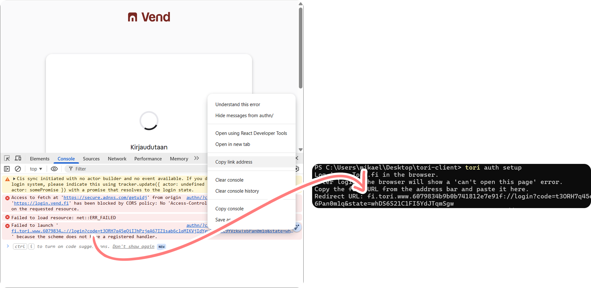

# Torium

Python client for the Tori.fi marketplace. Usable as a **library**, a **CLI tool**, and an **MCP server**.

## MCP: Local install (stdio)

**1. Clone and install:**

```bash
git clone https://github.com/ahnl/torium
uv tool install ./torium
```

This places `torium-mcp` (and `torium`) on your PATH globally. No venv path needed.

**2. Authenticate (once):**

```bash
torium auth setup
```

Opens a browser for OAuth login. On macOS the redirect is captured automatically. 

On Windows/Linux, after login the browser will show an infinite loading spinner or a "can't open" error. Open the browser's developer tools (F12) → Console, find the failed redirect URL starting with `fi.tori.www...`, right-click it to copy the link address, and paste it into the terminal. **Do this quickly. The code in the URL expires in 30-60 seconds.**



Credentials will be saved to `~/.config/torium/credentials.json`. Alternatively, set `TORI_REFRESH_TOKEN` in your environment. The MCP server will use it directly, no credentials file needed.

**3. Add to Claude Desktop:**

Go to **Settings → Developer → Edit Config** and add:

```json
{
  "mcpServers": {
    "torium": {
      "command": "torium-mcp"
    }
  }
}
```

Restart Claude Desktop. The torium tools are now available.

**Updating:**

```bash
cd torium && git pull && uv tool install --reinstall .
```

---

## MCP: Self-hosted remote server

You can run `torium-mcp` as a remote HTTPS server that multiple users connect to via claude.ai connectors. Each user authenticates their own Tori.fi account through a one-time OAuth popup.

By default, the server uses an email whitelist. You must allow each user before they can log in.

**1. Allow your email (must be done before first login):**

```bash
torium-mcp allow you@example.com --note "your name"
torium-mcp list-allowed    # see who has access
torium-mcp revoke foo@example.com  # remove access
```

**2. Start the server:**

```bash
torium-mcp --transport streamable-http --host 127.0.0.1 --port 5001 --base-url https://tori.example.com
```

The `--base-url` must be the public HTTPS URL that claude.ai can reach (e.g. via a reverse proxy or SSH tunnel).

**3. Add `https://tori.example.com/mcp` in claude.ai connectors.**

Claude opens a login popup. Click **Log in to Tori.fi**, complete the Schibsted login, then copy the `fi.tori.www...` redirect URL from the browser console and paste it into the form. After that, Claude has a 180-day session, with no further logins needed until it expires.

> Each user's Tori credentials are stored separately in SQLite (`~/.config/torium/mcp.db`). The local `~/.config/torium/credentials.json` file used by stdio mode is never touched by the remote server.

---

## Authentication

```bash
torium auth setup    # first-time OAuth login (see MCP: Local install above), saves refresh token
torium auth status   # show stored token info and expiry
```

You can also skip the browser flow entirely by setting `TORI_REFRESH_TOKEN` in your environment.

The refresh token rotates and is saved on each use (valid ~1 year; bearer token valid ~1 hour).

---

## CLI Reference

### Listings

```bash
torium listings                      # active listings (default)
torium listings --facet ALL          # ACTIVE | EXPIRED | DRAFT | DISPOSED | ALL
torium listings stats <id>           # clicks, messages, favorites
torium listings dispose <id>         # mark as sold (merkitse myydyksi)
torium listings delete <id>          # permanently delete (asks for confirmation)
torium listings delete <id> --yes    # skip confirmation
torium listings edit <id> --price 7  # change price
torium listings edit <id> --title "New title" --description "..."
torium listings edit <id> --dry-run  # inspect current values without saving
torium categories --for-create       # browse categories with IDs for listing creation
torium categories kengät --for-create  # filter by Finnish keyword
torium listings create --title "Kenkä" --description "..." --price 10 --category 193 --postal-code 96100
torium listings create ... --condition 3 --trade-type 1  # condition: 1=Uusi 2=Kuin uusi 3=Hyvä 4=Tyydyttävä
```

### Search

```bash
torium search "iphone"
torium search "iphone" --category 1.93.3217
torium search "iphone" --location 1.100018.110091  # filter by region/municipality
torium search "iphone" --price-from 100 --price-to 500
torium search "iphone" --shipping          # ToriDiili items only
torium search "iphone" --page 2
torium search "iphone" --filters           # show available filter options
torium categories                    # browse categories with codes for search (default, same as --for-search)
torium categories kengät             # filter by Finnish keyword
torium locations                     # browse regions and municipalities
torium locations helsinki            # filter by Finnish keyword
```

Results include a promoted (paalupaikka) listing when one exists. The Type column shows Myydään / Ostetaan / Annetaan.

### Messages

```bash
torium messages                      # list conversations with unread counts
torium messages --ids                # also show full conversation IDs
torium messages read <n>             # show thread (use row number from the list)
torium messages send <n> "text"      # send a message
```

Row numbers are cached at `~/.cache/torium/conversations.json`. Re-run `torium messages` to refresh.

### Show listing

```bash
torium show <id>                     # full details of any listing (own or public)
```

Shows title, price, type, category, location, condition/extras, description, and image URLs.

### Favorites

```bash
torium favorites                     # list favorited items
```

---

## MCP Tools

See [MCP: Local install (stdio)](#mcp-local-install-stdio) above for setup. The following tools become available once the server is running:


| Tool                  | Description                                                                  |
| --------------------- | ---------------------------------------------------------------------------- |
| `list_my_listings`    | Own listings, optional `facet` filter                                        |
| `search_my_listings`  | Own listings with full detail                                                |
| `get_listing`         | Full detail of any listing: title, description, price, extras, image URLs    |
| `get_listing_stats`   | Clicks / messages / favorites for a listing                                  |
| `get_create_categories` | Find category IDs by Finnish keyword (for create_listing)                  |
| `create_listing`      | Create and publish a new free listing                                        |
| `dispose_listing`     | Mark a listing as sold                                                       |
| `delete_listing`      | Permanently delete a listing                                                 |
| `edit_listing`        | Edit price, title, or description of a listing                               |
| `get_unread_count`    | Total unread messages                                                        |
| `list_conversations`  | Inbox with unread counts                                                     |
| `get_conversation`    | Full message thread                                                          |
| `send_message`        | Send a message in a conversation                                             |
| `list_favorites`      | Favorited items                                                              |
| `search_listings`     | Search public Tori.fi listings                                               |
| `get_search_categories` | Find category codes by Finnish keyword (for search_listings)               |
| `get_locations`       | Find region/municipality codes by Finnish keyword (for search_listings)      |
| `list_saved_searches` | Saved search alerts (hakuvahti)                                              |
| `create_saved_search` | Create a hakuvahti                                                           |
| `delete_saved_search` | Delete a hakuvahti                                                           |
| `fetch_image`         | Fetch a listing photo by URL and return it as an image for vision inspection |
| `fetch_image_base64`  | Fetch a listing photo and return it as a base64 data URI for HTML embedding  |


### Image inspection and display

Claude Desktop's `web_fetch` cannot load URLs that originate from MCP tool responses (a prompt-injection security restriction). Both image tools work around this by fetching server-side.

`**fetch_image**` returns the image as an MCP image object. Use this when you want Claude to inspect a photo with vision: condition, model numbers, serial numbers, spec stickers, visible damage, included accessories, port layout, etc.

`**fetch_image_base64**` returns a `data:image/jpeg;base64,...` URI. Use this to embed photos in an HTML artifact rendered inside Claude Desktop. Drop the returned string straight into an `` tag to build listing cards, search result galleries, or side-by-side comparisons.

```html
<!-- example: listing card from fetch_image_base64 -->

```

---

## Library Usage

```python
from torium import ToriClient

client = ToriClient()                        # reads ~/.config/torium/credentials.json
client = ToriClient(refresh_token="eyJ...")  # explicit token

# Listings
listings = client.listings.search(facet="ACTIVE")
client.listings.dispose(12345)
client.listings.delete(12345)
stats = client.listings.stats(12345)
client.listings.create("Title", "Desc", price=10, category="193", postal_code="96100")
client.listings.set_price(12345, 7)          # change price directly
values, etag = client.listings.get_for_edit(12345)  # fetch for editing
values["title"] = "New title"
client.listings.update(12345, values, etag)  # submit full update

# Messaging
convs = client.messaging.list_conversations()
msgs = client.messaging.list_messages(conv_id)
client.messaging.send(conv_id, "Kiinnostaa!")

# Search
results = client.search.search("iphone", price_from=100, price_to=500)
categories = client.search.categories()

# Favorites
favs = client.favorites.list()
```

---

## Disclaimer

Torium is an independent, community-developed interoperability client for
the Tori.fi marketplace. It is not affiliated with, endorsed by, or
sponsored by Tori.fi, Vend Marketplaces Oy, or Schibsted.

This software is provided "as is", without warranty of any kind.

By using Torium, you acknowledge that:
- You are the registered holder of the Tori.fi account you authenticate with
- Your use is your own responsibility and must comply with any agreements
  you have with third parties, including Tori.fi
- The authors assume no liability for any consequences of your use

---

## Project Structure

```
torium/
├── auth.py          # OAuth flow, credential storage, ToriAuth class
├── client.py        # ToriClient: HTTP session, signing, auth retry
├── signing.py       # finn-gw-key HMAC-SHA512 signing
├── listings.py      # ListingsAPI
├── messaging.py     # MessagingAPI
├── favorites.py     # FavoritesAPI
├── search.py        # SearchAPI (public search + hakuvahti)
├── cli.py           # Typer CLI
├── mcp_server.py    # FastMCP server + login routes + CLI (serve/allow/revoke)
├── mcp_auth.py      # MCP OAuth 2.1 provider + Schibsted code exchange
└── mcp_storage.py   # SQLite storage for multi-tenant sessions and tokens
```

---

## License

[MIT](LICENSE)
